# Dokumentation:

## Aufgabenstellung:

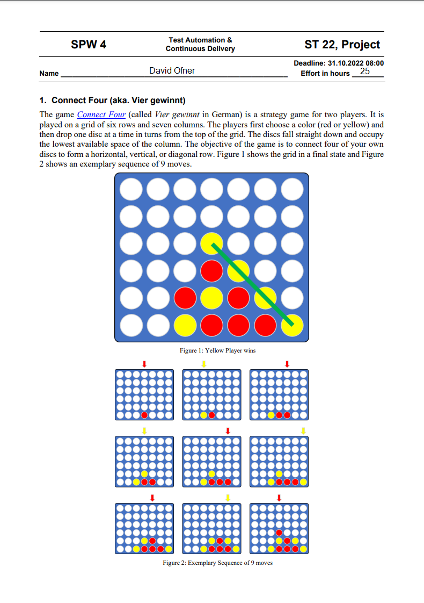
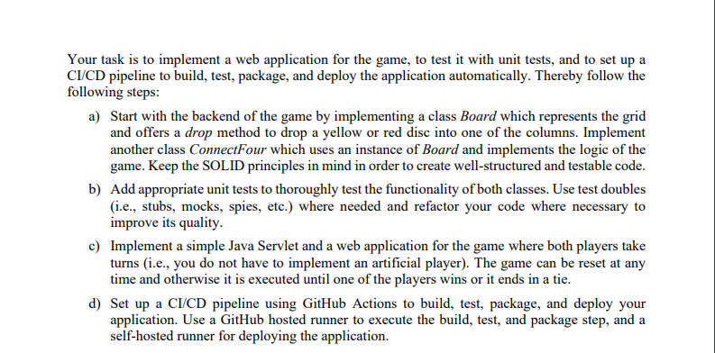

Tatsächlicher Aufwand: ca. 35 Stunden

## System:

SDK: jdk-8.0.302.8-hotspot

Language Level: 8

IntelliJ Idea Ultimate Edition

## ConnectFour-Game:

Hierbei handelt es sich um eine Jakarta EE Webanwendung, welche mit Java Servlets umgesetzt wurde.
Ziel war es, das bekannte Spiel 4-Gewinnt zu implementieren.

Bei diesem Spiel treten zwei Spieler gegeneinander an und spielen nacheinander in einem 7x7 Feld ihre Scheiben.
Sind vier Scheiben von einem Spieler (gleiche Farbe) nebeneinander, übereinander oder diagonal gereiht, gewinnt dieser:

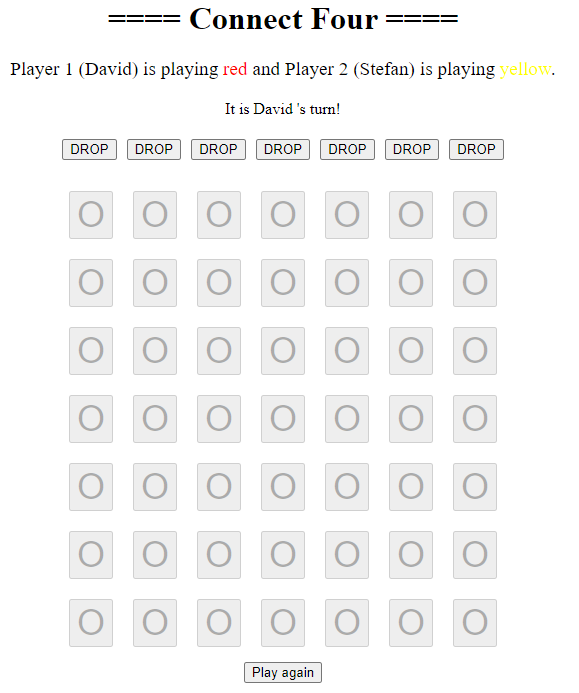

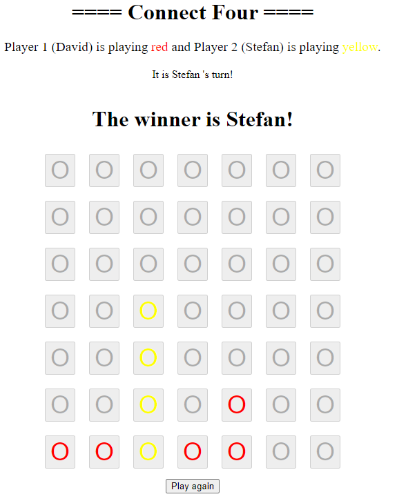

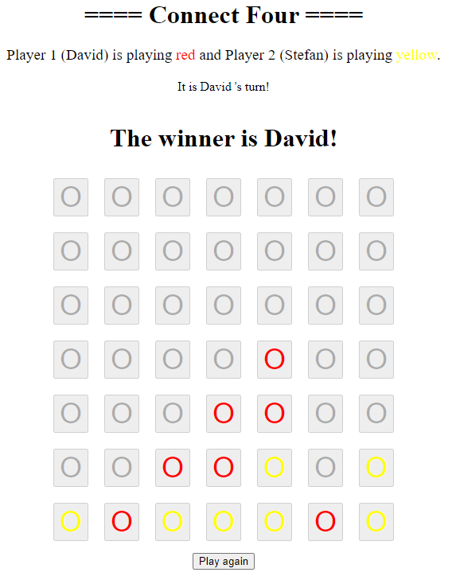

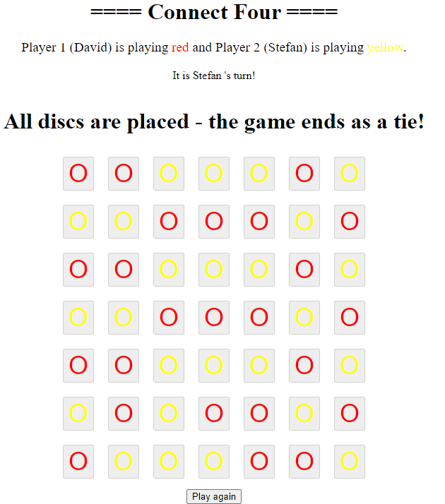

Das Spiel geht also so lange, bis entweder einer der Spieler gewonnen hat, 
oder bis alle Scheiben gespielt wurden. Zu jeder Zeit kann das Spiel neu gestartet werden.

## Tests:

Bei den Tests wurden bis auf kleine Ausnahmen (alle Spielrichtungen) alle Klassen und Methoden getestet:

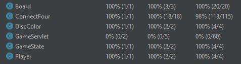

### Mock vs. Spy in Mockito:

Wenn Mockito ein Mock erstellt, geschieht dies anhand der Klasse eines Typs, nicht anhand einer tatsächlichen Instanz.
Der Mock erstellt einfach eine einfache Shell-Instanz der Klasse, die vollständig instrumentiert ist, um Interaktionen mit ihr zu verfolgen.

Der Spion hingegen umhüllt eine vorhandene Instanz. Sie verhält sich genauso wie die normale Instanz; der einzige Unterschied ist, dass sie auch instrumentiert wird, um alle Interaktionen mit ihr zu verfolgen.

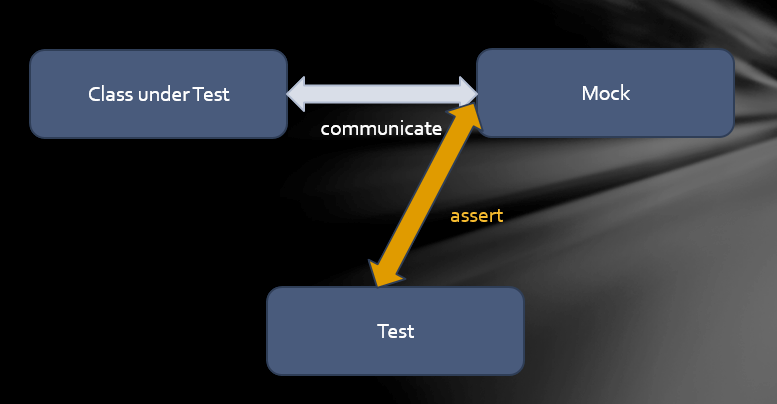

Ein Stub ist ein kontrollierbarer Ersatz für eine bestehende Abhängigkeit (oder einen Kollaborateur) im System. Durch die Verwendung eines Stubs können Sie Ihren Code testen, ohne sich direkt mit der Abhängigkeit auseinandersetzen zu müssen.

Ein Mock-Objekt ist ein unechtes Objekt im System, das darüber entscheidet, ob der Unit-Test bestanden hat oder nicht. Dazu wird überprüft, ob das zu testende Objekt wie erwartet mit dem Scheinobjekt interagiert.

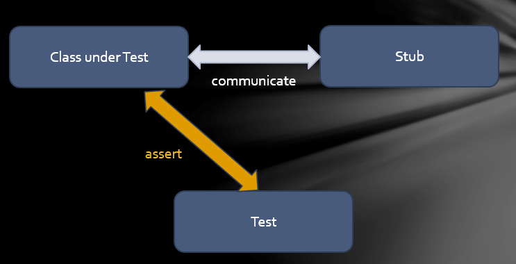

## CI/CD:

### Systemvoraussetzung

siehe "Systemvoraussetzung für die 3.Übung.pdf"

### GitHub Hosted Runner

GitHub bietet gehostete virtuelle Maschinen zur Ausführung von Workflows an. Die virtuelle Maschine enthält eine Umgebung mit Tools, Paketen und Einstellungen, die für GitHub-Aktionen zur Verfügung stehen.

Runner sind die Maschinen, die Aufgaben in einem GitHub-Aktions-Workflow ausführen. Ein Runner kann zum Beispiel Ihr Repository lokal klonen, Testsoftware installieren und dann Befehle ausführen, die Ihren Code bewerten.

Die Installation wurde laut Github-Setting-Action durchgeführt:
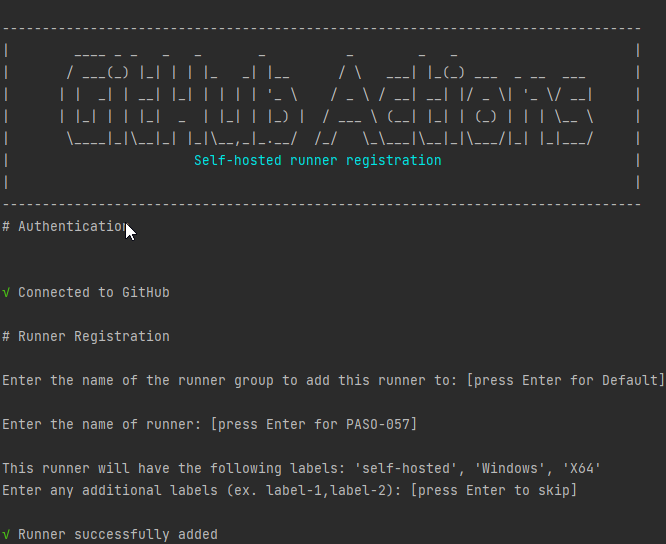

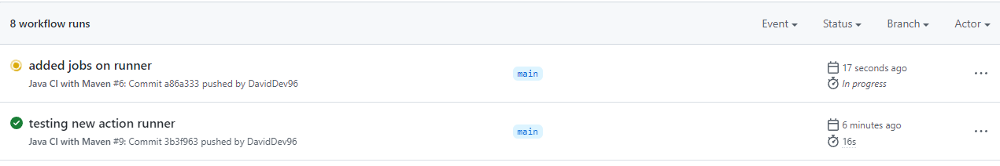

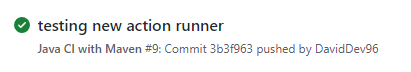

Im Workflow File wurden dieselben Jobs wie bei der Übungsvorlesung übernommen und angepasst.