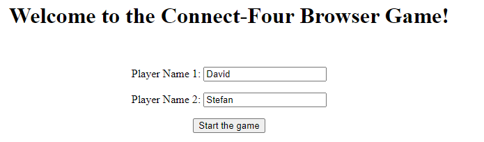

# Dokumentation:

## Aufgabenstellung:

Tatsächlicher Aufwand: ca. 35 Stunden

## System:

SDK: jdk-8.0.302.8-hotspot

Language Level: 8

IntelliJ Idea Ultimate Edition

## ConnectFour-Game:

Hierbei handelt es sich um eine Jakarta EE Webanwendung, welche mit Java Servlets umgesetzt wurde.
Ziel war es, das bekannte Spiel 4-Gewinnt zu implementieren.

Bei diesem Spiel treten zwei Spieler gegeneinander an und spielen nacheinander in einem 7x7 Feld ihre Scheiben.
Sind vier Scheiben von einem Spieler (gleiche Farbe) nebeneinander, übereinander oder diagonal gereiht, gewinnt dieser:

Das Spiel geht also so lange, bis entweder einer der Spieler gewonnen hat, 
oder bis alle Scheiben gespielt wurden. Zu jeder Zeit kann das Spiel neu gestartet werden.

## Tests:

Bei den Tests wurden bis auf kleine Ausnahmen (alle Spielrichtungen) alle Klassen und Methoden getestet:

### Mocks, Stubs und Spys:

Ein Mock-Objekt wird als Platzhalter für echte Objekte verwendet. 
Es handelt sich hier um eine Attrappe oder vorgetäuschtes Objekt mit dem man die 
Schnittstellen des testenden Objekts darstellt. 

Mock-Objekte implementieren Schnittstellen, über die das testende Objekt (ConnectFour, Game) auf seine Umgebung zugreift.
Sie stellen sicher, dass sie erwarteten Methodenaufrufe vollständig, mit den korrekten Parametern in der
erwarteten Reihenfolge durchgeführt werden.

Hier verwendet man üblicherweise ein Mocking Framework wie Mockito.

In diesem Fall hab ich bei den Tests auf Mocks verzichtet, da die nötigen Tests allein in Unit-Tests abgebildet werden können.

Ein Stub-Objekt ist auch ein Hilfsobjekt, welches beim Aufruf einer bestimmten Methode unabhängig von der Eingabe die gleiche Ausgabe liefert.

Durch die Verwendung eines Stubs können Sie Ihren Code testen, ohne sich direkt mit der Abhängigkeit auseinandersetzen zu müssen.

Spies geben Auskunft darüber, wie oft eine Funktion aufgerufen wird, welche Argumente übergeben wurden
und welche Wert retourniert wird. 
Ein Spy ist also gut um zu verifizieren, was bei diesem Test passiert. 

## CI/CD:

### Systemvoraussetzung

siehe "Systemvoraussetzung für die 3.Übung.pdf"

### GitHub Hosted Runner

GitHub bietet gehostete virtuelle Maschinen zur Ausführung von Workflows an. Die virtuelle Maschine enthält eine Umgebung mit Tools, Paketen und Einstellungen, die für GitHub-Aktionen zur Verfügung stehen.

Runner sind die Maschinen, die Aufgaben in einem GitHub-Aktions-Workflow ausführen. Ein Runner kann zum Beispiel Ihr Repository lokal klonen, Testsoftware installieren und dann Befehle ausführen, die Ihren Code bewerten.

Die Installation wurde laut Github-Setting-Action durchgeführt:

Im Workflow File wurden dieselben Jobs wie bei der Übungsvorlesung übernommen und angepasst.